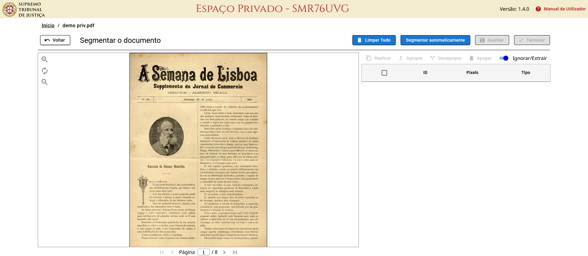

# Editar os Resultados

Para abrir a interface de **Edição de Resultados** de um documento, clique em <kbd>**⋮**</kbd> ou use o **botão direito do rato** para abrir o menu, e selecione 

O texto obtido em cada página é apresentado à direita, para comparação com a página original à esquerda.

<figure><figcaption></figcaption></figure>


A qualquer momento pode clicar em  para guardar as alterações feitas e retomar o trabalho mais tarde.



Quando os resultados forem aceitáveis, clique em  para recriar os resultados usando o novo texto.



Pode gerar novos tipos de resultados sem precisar de repetir o OCR selecionando novos formatos na i[nterface de configuração](configurar-ocr.md#formatos-de-resultados) antes de confirmar a recriação.


***

## Identificar erros

Para **identicar possíveis erros de OCR**, clique em 

Cada palavra no texto à direita será colorida de acordo com o grau de confiança com que ela foi obtida:

* <mark style="color:green;">Verde</mark> para alta confiança
* <mark style="color:orange;">Laranja</mark> para média confiança
* <mark style="color:red;">Vermelho</mark> para baixa confiança

Para **ver onde foi identificada uma palavra**, coloque o rato sobre a palavra no texto.

<figure><figcaption></figcaption></figure>

***

## Editar palavras



### Selecione uma ou mais palavras numa linha

As palavras surgirão numa caixa de texto para edição.

<figure><figcaption></figcaption></figure>

<figure><figcaption></figcaption></figure>



### Pressione <kbd>Enter</kbd> ou clique fora da caixa para confirmar

<figure><figcaption></figcaption></figure>



### Repita para aplicar as correções desejadas




### Guarde as alterações clicando em  ou volte a gerar os ficheiros de resultados clicando em 



***

## Adicionar ou remover linhas

Se desejar **ajustar as quebras de linha** que serão consideradas nos resultados em formato de texto:



### Clique em 



### Clique nos botões  para unir uma linha à seguinte



### Passe o rato sobre as palavras e clique nos botões  para adicionar quebras de linha

<figure><figcaption></figcaption></figure>



### Feche a ferramenta clicando em 



### Guarde as alterações clicando em  ou volte a gerar os ficheiros de resultados clicando em 


