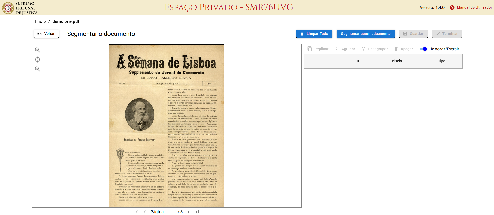

# Segmentar o Documento


Não é obrigatório fazer a segmentação do documento para realizar a extração de texto.


Para abrir a interface de **Segmentação** de um documento, clique em <kbd>**⋮**</kbd> ou use o **botão direito do rato** para abrir o menu, e selecione 

Esta interface permite:

* **limitar o reconhecimento** a algumas áreas de cada página
* **identificar imagens para extrair** do documento

<figure><figcaption></figcaption></figure>


A qualquer momento pode clicar em  para guardar as alterações feitas, ou em   para guardar e sair.



Num documento já segmentado, a opção do menu é alterada para: 


***

## Definir áreas na página



#### Clique na imagem e arraste para formar um retângulo

A caixa do segmento será sobreposta à imagem e adicionada à lista.

<figure><figcaption></figcaption></figure> <figure><figcaption></figcaption></figure>




#### Ajuste e redimensione o segmento arrastando os quatro cantos

<figure><figcaption></figcaption></figure>



#### Repita os passos anteriores para as áreas desejadas

<figure><figcaption></figcaption></figure>



#### Termine clicando em 



***

## Reordenar segmentos

Na lista à direita, **arraste cada linha** usando o ícone à esquerda, colocando-as pela ordem desejada.

<figure><figcaption></figcaption></figure>

<figure><figcaption></figcaption></figure>

***

## Extrair imagens

Para **obter as imagens** da página durante o OCR:



#### Selecione a área desejada, como descrito [anteriormente](segmentar-o-documento.md#definir-areas-na-pagina)



#### Na lista à direita, mude o interruptor do segmento para 

<figure><figcaption></figcaption></figure>




Os segmentos definidos desta forma serão **extraídos** como ficheiros **PNG** e ficarão disponíveis num arquivo **ZIP** após a conclusão do OCR.


***

## Definir áreas a ignorar

O interruptor no canto superior direito da tabela proporciona dois modos:

*   - para extrair texto dos segmentos selecionados
*  - para ignorar os segmentos selecionados.

No modo **Ignorar**, os identificadores das caixas mudam do formato **TX.X** para **RX.X**.

<figure><figcaption></figcaption></figure>


No modo **Ignorar**, os segmentos de **Imagem** serão extraídos sem serem afetados pelos segmentos ignorados.


***

## Replicar segmentos

Por vezes os documentos têm uma **estrutura fixa** para todas as páginas, ou incluem **cabeçalhos** repetitivos que se pretende ignorar.

Para **replicar segmentos em todas as páginas**, selecione-os na lista e clique em 


Qualquer alteração na forma de um segmento replicado será aplicada em todas as outras páginas.


***

## Agrupar segmentos

Para **agrupar** segmentos, selecione várias linhas da lista e clique em 


Um **grupo** de segmentos é representado por uma única linha na tabela, e pode ser reordenado em conjunto, mantendo a sua ordem interna.


Para **desagrupar** os segmentos, selecione a linha do **grupo** e clique em 

***

## Segmentar automaticamente

Para pedir ao servidor uma segmentação automática de todo o documento, clique em  e aguarde.


Para documentos com um grande número de páginas, o processo pode demorar vários minutos.

